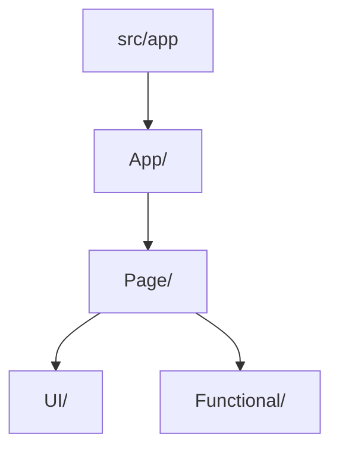

# AI Assistant Instructions

> **Note**: This file is the source for symlinks `AGENTS.md` and `CLAUDE.md`. They are not duplicates but references to this single source of truth, ensuring consistency across AI assistants.

## Project Overview

Next.js 15.x blog with TypeScript, React 19.x, and Panda CSS. Japanese content focus with ML-powered features.

## 🔴 Critical Requirements

```bash
# MUST run before any development/build
npm run prebuild  # Updates submodules, processes content, generates assets
npm run dev       # Development server on port 8080
```

## Architecture

### Directory Structure

```
src/
├── app/              # Next.js App Router (routes)
├── components/       # Component hierarchy
│   ├── App/         # Application shell (Header, Footer, Layout)
│   ├── Page/        # Page-specific components
│   │   └── _shared/ # Shared page sections
│   ├── UI/          # Reusable UI components (zero-margin principle)
│   └── Functional/  # Utility components (Container, JsonLd)
├── ui/              # Styling system
└── types/           # TypeScript definitions
```

### Component Principles

- **Zero Margin**: Components don't set their own margins - parent controls spacing
- **Container Sizes**: small (768px), default (1024px), large (1280px)
- **UI/UX Guidelines**: See [@docs/ui-ux-guidelines.md](docs/ui-ux-guidelines.md) (principles) and [@docs/ui-ux-implementation.md](docs/ui-ux-implementation.md) (implementation)
- **Layer Dependencies**:



- UI and Functional are **independent layers** with no mutual dependencies
- All layer dependencies are statically enforced by Biome (see biome.json)

### Layer Responsibilities

#### App/
- **Purpose**: Application-wide structure and layout
- **Examples**: Header, Footer, Layout
- **Characteristics**:
  - Singleton-like components
  - Can depend on lower layers only
  - Defines the overall application shell

#### Page/
- **Purpose**: Page-specific logic and components
- **Examples**: Post components, Archive components, Home components
- **Characteristics**:
  - Contains business logic
  - `Page/_shared/` for sections shared across multiple pages
  - Can depend on UI and Functional layers only
  - Cannot depend on App layer

#### UI/
- **Purpose**: Reusable visual presentation components
- **Examples**: Button, Card, Modal, Tooltip, Alert, LinkMore
- **Characteristics**:
  - Follows Zero Margin principle
  - No dependencies on other component layers
  - Pure visual components with no business logic

#### Functional/
- **Purpose**: Functional utility components without visual representation
- **Examples**: PreconnectLinks, ReadingHistoryRecorder
- **Characteristics**:
  - No visual output (or minimal)
  - Handles metadata, optimization, and utility functions
  - No dependencies on other component layers

### Architecture Rationale

This layered architecture provides:
- **Clear separation of concerns**: Each layer has a single, well-defined responsibility
- **Maintainability**: Changes are localized to specific layers
- **Testability**: Layers can be tested independently
- **Scalability**: New features can be added without affecting existing layers
- **Static verification**: Biome enforces all dependency rules at compile time

## Development Workflow

### Essential Commands

```bash
npm run prebuild     # Required before dev/build
npm run dev          # Development server
npm run build        # Production build
npm run lint         # Biome linting (fast)
npm test             # Vitest tests
```

### Styling System

```tsx
// Panda CSS - Use template literals only
import { css, styled } from '@/ui/styled';

const StyledDiv = styled.div`
  background: var(--colors-gray-a-3);
  padding: var(--spacing-2);
`;
```

### Path Aliases

- `@/*` → `src/*`
- `~/*` → project root

## Content Architecture

1. **Source**: Git submodule `_article/_posts/*.md` (DO NOT edit directly)
2. **Processing**: `npm run prebuild` generates JSON files
3. **Consumption**: Static generation uses processed JSON

## Coding Standards

### TypeScript

- Strict mode enabled
- Explicit types for all public APIs
- Type-only imports where applicable

### React/Next.js

- App Router patterns (not Pages Router)
- Server Components by default
- Client Components only when needed (`'use client'`)

### Import Order

1. External libraries
2. Internal utilities (`@/lib`, `@/utils`)
3. Components (`@/components`)
4. Types (`@/types`)
5. Styles and constants

### File Naming

- Components: PascalCase (`PostContent.tsx`)
- Utilities: camelCase (`getPostData.ts`)
- Constants: UPPER_SNAKE (`MAX_POSTS`)

## Performance Optimization

- Static generation with ISR-like updates
- Code splitting via route groups
- Image optimization with Next.js Image
- Bundle analysis: `npm run build:analyzer`

## Testing Strategy

- Unit tests for utilities and hooks
- Integration tests for critical paths
- Coverage target: 80%

## Common Patterns

### Data Fetching

```typescript
// Use in Server Components
async function getData() {
  const posts = await import('@/posts.json');
  return posts.default;
}
```

### Error Handling

```typescript
// Result type for functional error handling
import { Result } from '@/build/similarity/result';
```

## Important Notes

1. **Japanese Content**: Special text processing for Japanese morphological analysis
2. **Build Dependencies**: Playwright required (`playwright install --only-shell`)
3. **Environment**: `TZ=Asia/Tokyo` for consistent timestamps
4. **Pre-commit**: Husky hooks with nano-staged configured

## Quick Verification

For rapid feedback after code changes, use these targeted commands:

```bash
# Type-check specific file only (fastest)
npx tsc --noEmit --skipLibCheck src/components/MyComponent.tsx

# Lint specific file only
npx @biomejs/biome check src/hooks/useDialog.ts

# Test specific file/pattern only
npm test -- useDialog        # Tests matching "useDialog"
npm test -- src/hooks/       # All tests in hooks directory

# Build without linting (faster build)
npx next build --no-lint --webpack

# Build specific page only (experimental)
npx next build --experimental-build-mode=compile --webpack

# Hot reload already running (port 8080)
# Just save the file - Next.js dev server auto-reloads
```

## Quick Reference

| Task              | Command                             |
| ----------------- | ----------------------------------- |
| Start development | `npm run prebuild && npm run dev`   |
| Run tests         | `npm test`                          |
| Check types       | `tsc --noEmit --skipLibCheck`       |
| Lint code         | `npm run lint`                      |
| Build production  | `npm run prebuild && npm run build` |

---

_Generated for GitHub Copilot, Cursor, and other AI assistants. Keep concise and actionable._

**IMPORTANT**: Do NOT modify files in `_article/` directory (Git submodule)
